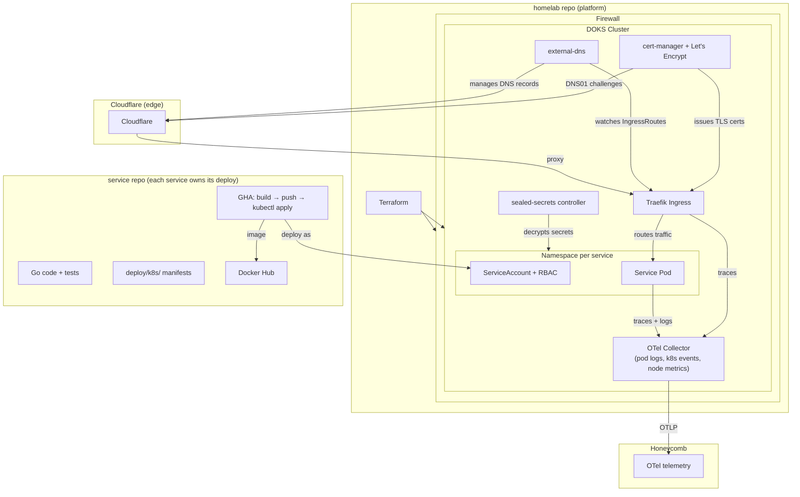

# homelab

## Architecture

## Service Onboarding  
### homelab repo (once per service)

1. Create `k8s/services/<name>/` with Namespace, ServiceAccount, Role, RoleBinding 
2. Add `kubectl apply` step to `.github/workflows/post-merge.yml` 
3. Add `DO_TOKEN` secret (DigitalOcean API token) to the service's GitHub repo — the CD pipeline uses `doctl` to generate fresh cluster credentials at deploy time
4. If the service sends OTLP, add its namespace to the filelog exclude list in
`k8s/platform/otel-collector/configmap.yaml`

### service repo

1. Multi-stage Dockerfile (build + scratch/alpine runtime)
2. GHA pipeline: build → push to Docker Hub → `doctl` auth → `kubectl apply -f deploy/k8s/`
3. `deploy/k8s/` manifests:
    - Deployment (stateless) or StatefulSet (persistent identity/storage)
    - Service (ClusterIP) — HTTP or gRPC services
    - IngressRoute with `Host()` rule — external-facing services only
    - SealedSecrets for any sensitive env vars
4. OTLP exporter points at `otel-collector.otel-collector.svc.cluster.local:4317`

### What's automatic

- **DNS**: external-dns creates A records from IngressRoute `Host()` rules
- **TLS**: cert-manager issues certs via ClusterIssuer + Cloudflare DNS01
- **Logs**: otel-collector filelog receiver scrapes stdout (for services not sending OTLP)
- **Routing**: Traefik routes based on IngressRoute CRDs — no Traefik config changes needed
