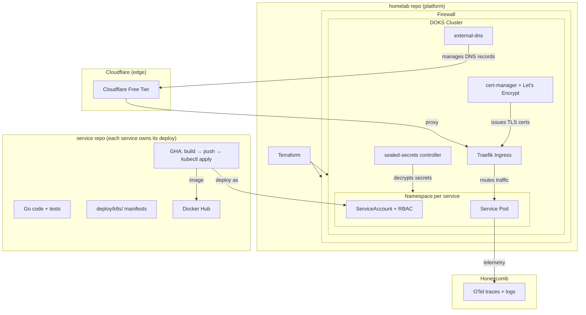

# homelab

## Architecture

```mermaid
graph TB                                                                                            
    subgraph "homelab repo (platform)"                                                              
        TF[Terraform]                                                                               
        subgraph FW[Firewall]
            subgraph DOKS[DOKS Cluster]
                TRAEFIK[Traefik Ingress]
                CM[cert-manager + Let's Encrypt]
                EDNS[external-dns]
                SS[sealed-secrets controller]
                subgraph NS[Namespace per service]
                    SVC_SA[ServiceAccount + RBAC]
                    SVC_POD[Service Pod]
                end
                TRAEFIK -->|routes traffic| SVC_POD
                CM -->|issues TLS certs| TRAEFIK
                SS -->|decrypts secrets| NS
            end
        end
        TF --> FW
        TF --> DOKS
    end

    subgraph "Cloudflare (edge)"
        CF[Cloudflare Free Tier]
        CF -->|proxy| TRAEFIK
        EDNS -->|manages DNS records| CF
    end

    subgraph "service repo (each service owns its deploy)"
        SVC_CODE[Go code + tests]
        SVC_K8S[deploy/k8s/ manifests]
        SVC_GHA[GHA: build → push → kubectl apply]
        SVC_GHA -->|image| DH[Docker Hub]
        SVC_GHA -->|deploy as| SVC_SA
    end

    subgraph "Honeycomb"
        HC[OTel traces + logs]
    end

    SVC_POD -->|telemetry| HC
```